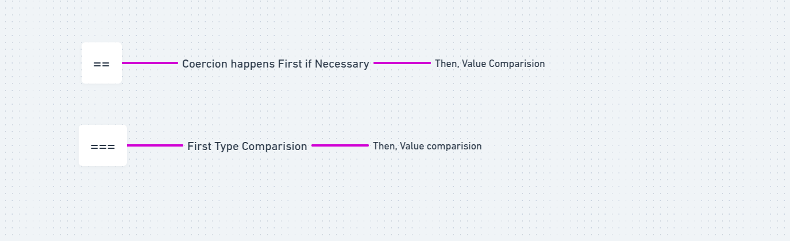
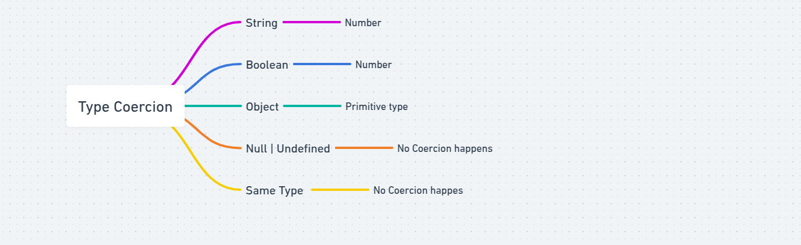

# Type Coercion Priority Order in == Comparisons

1. If both values are of the same type, no coercion happens.

```
console.log(5 == 5); // true
console.log("hello" == "hello"); // true
```

2. if one value is null and the other is undefined, its return true

```
console.log(null == undefined); // true
```

**Note**:-null and undefined are only equal to each other and no conversion happens.

3.  If one value is a number and the other is a string, string is convert to a number.

```
console.log("42" == 42); // true ("42" → 42)
console.log("0" == 0); // true ("0" → 0)
```

**Note**:-Strings get converted to numbers, not the other way around.

4. If one value is a boolean, convert it to a number.

```
console.log(true == 1); // true (true → 1)
console.log(false == 0); // true (false → 0)
console.log(false == ""); // true (false → 0, "" → 0)
```

**Note**:-Booleans are always converted to numbers (true → 1, false → 0)

- If the other value is a string, it gets converted to a number after the boolean.

- false == "" is true because false → 0, "" → 0, so 0 == 0.

5. If one value is an object, convert it to a primitive (toString() or valueOf()).

```
console.log([1] == 1); // true ([1] → "1", "1" → 1)
console.log([] == 0); // true ([] → "", "" → 0)
console.log([1, 2] == "1,2"); // true ([1, 2] → "1,2")
```

**Note**:- Objects are converted to primitives type.

- Arrays usually convert to strings (e.g., [1] → "1", [] → "").
- If compared to a number, the resulting string is converted to a number.

6. All other cases return false (no coercion applies).

```
console.log(null == 0); // false (null does not convert to 0)
console.log(undefined == 0); // false
console.log({} == "[object Object]"); // false (object does not auto-convert)
```

**Note**:-If no coercion rule applies, javascript simply returns false.


