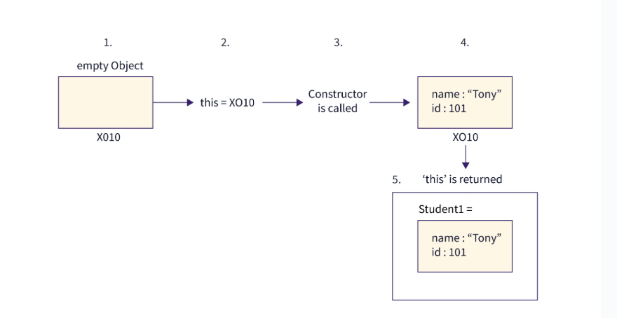

# Constructor Function

constructor functions technically are **regular functions**. There are two conventions thought:

1. They are named with capital letter first.

2. They should be executed only with new operator.

# Example 1

```
function User(name) {
  this.name = name;
  this.isAdmin = false;
}

let user = new User("Jack");

alert(user.name); // Jack
alert(user.isAdmin); // false

```

**Note:-** As you see in above example function name is in capital letter.

# What Happens When a Constructor is Called?

We have seen that to use a constructor we have to call it now let's see what happens under the hood of that process:

When we use the new keyword the following things happen:

1. A **new Empty object** is created

2. **"this"** is **set** to the **newly created object**

3. The constructor is called

4. Inside the **constructor** the given **properties** and **values** are **bound** to the **newly created object** by using **this.arg=arg**

5. The constructor **returns** **"this"** which means the object is returned since this is currently set to the newly created object.



# Example 2

```
function User(name){
    <!--this={}; (impliycitly) -->

    <!--add properties to this -->
    this.name=name;
    this.isAdmin=false;
    <!-- return this; (implicityly) -->
}
```

# create immediate called constructor

# Example 3

```
// create a function and immediately call it with new
let user = new function() {
  this.name = "John";
  this.isAdmin = false;

  // ...other code for user creation
  // maybe complex logic and statements
  // local variables etc
};
```

# Constructor mode test: new.target

1. we can check whether the function is called with **new keyword** or **without** it.

2. To check that we use new.target property

3. which return **undefined** if it was called **without new keyword** and if it is called **with new keyword** it will return **whole function**.

# Example 4

```
function User() {
  alert(new.target);
}

// without "new":
User(); // undefined

// with "new":
new User(); // function User { ... }
```

# Return from constructors

Usually, constructors **do not** have a **return** statement. Their task is to **write all necessary stuff into this**, and it **automatically** becomes the result.

**But if there is a return statement, then the rule is simple:**

1. If return is called with an object, then the object is returned instead of this.

2. If return is called with a primitive, it’s ignored means in all other cases this is returned.

# Example 5

```
function BigUser() {

  this.name = "John";

  return { name: "Godzilla" };
  <!--  returns this object -->
}

alert( new BigUser().name );
<!-- Godzilla, got that object -->
```

# Example 6

```
function SmallUser() {

  this.name = "John";

  return;
  <!-- returns this -->
}

alert( new SmallUser().name );  <!-- John -->
```

# Pros of Using Function Constructors

1. **Encapsulation of Object Creation**

   1. A function constructor allows you to define a blueprint for creating objects without manually setting properties each time.

   ```
   function Person(name, age) {
   this.name = name;
   this.age = age;
   }
    const person1 = new Person("Alice", 25);
    console.log(person1.name); // "Alice"
   ```

   2. Avoids repetitive manual object creation.

2. **Prototype-Based Method Sharing (Memory Efficient)**

   1. Methods can be attached to the prototype, ensuring that they are shared across instances (instead of duplicating them in memory).

   ```
   function Person(name, age) {
   this.name = name;
   this.age = age;
   }
   Person.prototype.greet = function () {
    return `Hello, my name is ${this.name}`;
    };
    const person1 = new Person("Alice", 25);
    const person2 = new Person("Bob", 30);
    console.log(person1.greet()); // ✅ Works
    console.log(person2.greet()); // ✅ Shared method (not copied in each object)
   ```

   2. **Efficient:** The greet() method is stored once in the Person.prototype, instead of being copied for each instance.

3. **Better Performance than Object Literals in Some Cases**

   1. Creating multiple objects using object literals inside loops can be **inefficient** because new functions get created in every iteration.

   2. Function constructors **avoid this** if methods are placed in the prototype.

   ```// Less efficient (each object gets its own copy of sayHello)
   for (let i = 0; i < 1000; i++) {
   const obj = {
    name: "Alice",
    sayHello: function () {
      console.log("Hello");
    },
   };
   }
   // More efficient with function constructor
   function Person(name) {
    this.name = name;
    }

    Person.prototype.sayHello = function () {
        console.log("Hello");
    };

    for (let i = 0; i < 1000; i++) {
        const obj = new Person("Alice"); // ✅ Methods are shared via prototype
    }

   ```

   3. Function constructors avoid redundant function creation in loops.

4. **Allows for Prototypal Inheritance**

   1. Function constructors support inheritance using prototypes.

   ```
   function Animal(name) {
    this.name = name;
   }

    Animal.prototype.speak = function () {
        return `${this.name} makes a sound.`;
    };

    function Dog(name, breed) {
        Animal.call(this, name); // Inherit properties
        this.breed = breed;
    }

    Dog.prototype = Object.create(Animal.prototype);
    Dog.prototype.constructor = Dog;

    Dog.prototype.bark = function () {
        return `${this.name} barks.`;
    };

    const dog1 = new Dog("Buddy", "Labrador");
    console.log(dog1.speak()); // ✅ "Buddy makes a sound."
    console.log(dog1.bark()); // ✅ "Buddy barks."
   ```

   3. Enables object-oriented inheritance.

# Cons of Using Function Constructors

1. **No Clear Syntax Compared to ES6 Classes**

   1. ES6 classes make the intent clearer and more structured.

   ```// Function constructor (harder to read)
   function Person(name, age) {
        this.name = name;
        this.age = age;
    }

    Person.prototype.greet = function () {
        return `Hello, I am ${this.name}`;
    };

    // ES6 class (clearer)
    class Person {
        constructor(name, age) {
        this.name = name;
        this.age = age;
    }

    greet() {
        return `Hello, I am ${this.name}`;
    }
    }
   ```

   2. ES6 classes are easier to read and understand.

2. **Forgetting new Causes Bugs**

   1. If you forget to use new, this will refer to the global object (window in browsers), leading to unexpected behavior.

   ```
    function Person(name) {
        this.name = name;
    }

    const p1 = Person("Alice"); // ❌ Forgot `new`
    // Now `this.name` was assigned to `window.name` (bad behavior)
    console.log(p1); // ❌ Undefined
    console.log(window.name); // ❌ "Alice" (unexpected)

   ```

   2. **Solution**: Use ES6 classes or check for new inside the constructor:

   ```
   function Person(name) {
   if (!(this instanceof Person)) {
    throw new Error("Must use new keyword");
   }
   this.name = name;
   }
   ```

   3. ES6 classes prevent this issue because they throw an error if new is missing.

3. **Verbose for Inheritance (Compared to Classes)**

   1. Inheritance with function constructors requires manual prototype chaining, while ES6 class inheritance is simpler.

4. **Harder to Debug and Maintain**

   1. Since function constructors rely on prototype chains, debugging can be tricky.

   2. Many JavaScript developers are now more familiar with ES6 classes than older function constructors.

# References

1. https://javascript.info/constructor-new

2. https://www.scaler.com/topics/javascript/javascript-constructor/

3. https://medium.com/@hridoymahmud/understanding-javascript-constructors-function-vs-class-63d140a44288