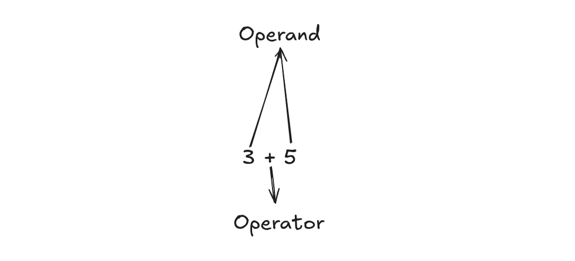
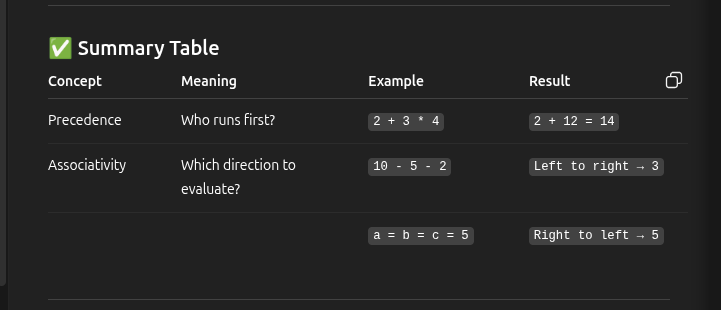
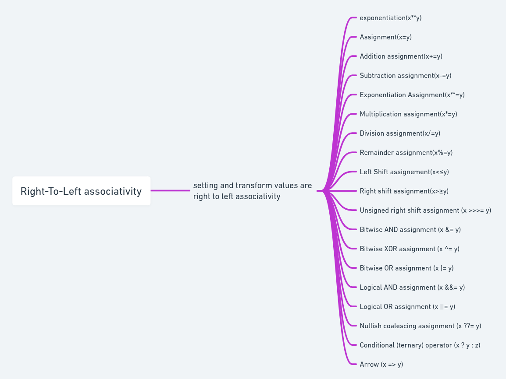

# Operator Precedence
Operator Precedence means which operator gets applied first when there are multiple operators in a single line of code - without parenthese.




# Precedence and Associativity

1. Precedence means the priority of operators — who should be evaluated first in an expression without parentheses.

2. Associativity decides which direction to go when two operators have the same precedence.
    - If left-to-right, it starts from the left
    - If right-to-lefft, it starts from right




# How to remember which operator have which associativity direction.

```Operator that involve setting  or transforming something (like ==,**,?:) have right-to-left associativity```
