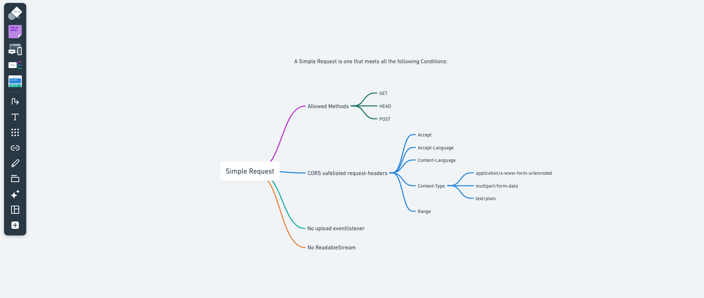
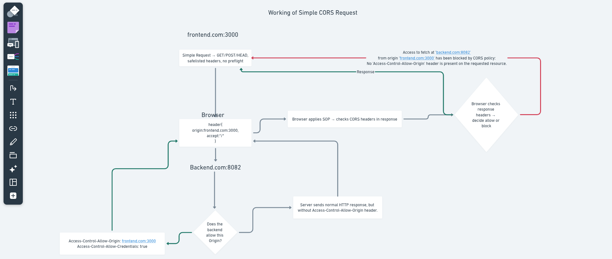

# Cross Origin
1. If origin are differents this is called a Cross-Origin
   - a.com:2000 and b.com:3000 both are different origin so we call it Cross Origin.

# What is Cross Origin Resource Sharing(CORS)
1. Cross-Origin Resource Sharing(CORS) is an HTTP-header based mechanism
   - This means CORS works entirely by sending and reading special HTTP headers between the browser and the server to decide whether a web page from one origin can access resources from another origin.
2. When the browser sees a request is ```cross-origin```, it automatically adds an ```Origin header``` to the HTTP request to tell the server where the request came from.

# Types of CORS requests
CORS requests are generally classified into two main types:
   - Simple Requests
   - Preflight Requests

# Simple Requests
A simple request is a type of ```cross-origin``` request that the browser ```sends directly``` without doing a ```preflight check first```.

1. A simple request is one that meets all the following conditions:
   - One of the allowed methods:
      - GET
      - HEAD
      - POST
   - CORS-Safelisted Request Headers:- Headers that can be manually set without triggering a CORS preflight.
      - Accept
      - Accept-Language
      - Content-Language
      - Content-Type
         - application/x-www-form-urlencoded
         - multipart/form-data
         - text/plain
      - Range (Single range header Value)
   - No upload eventlistener
      - if you use XMLHttpRequest, you must not have registered event listeners on xhr.upload
      - ```xhr.upload.addEventListener('progress', ...); // ❌ This makes it non-simple```
   - No ReadableStream
      - The request must not use a ```ReadableStream``` for the body.



# Working of Simple Request
