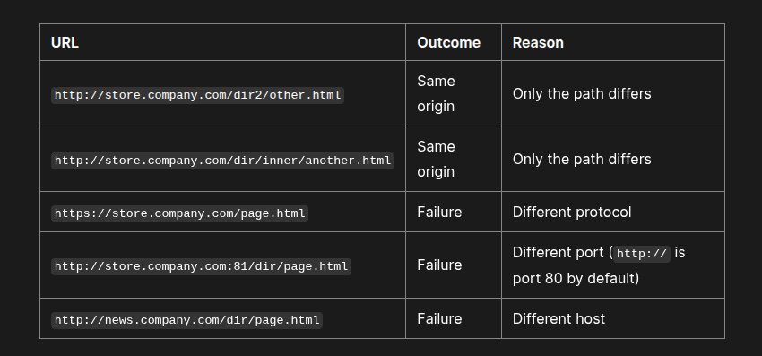
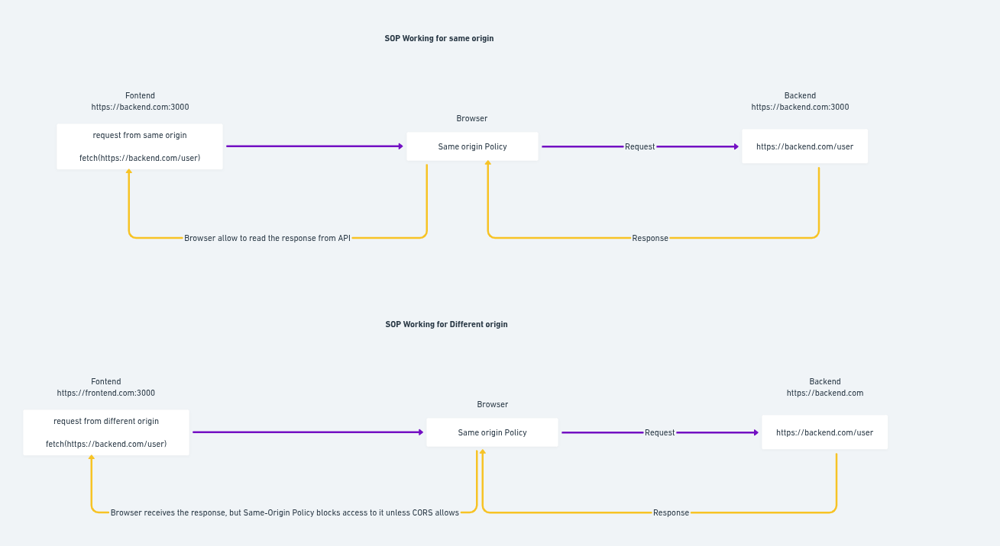
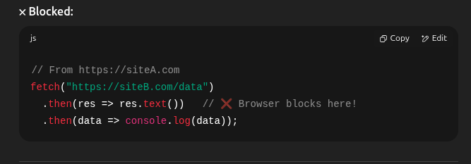
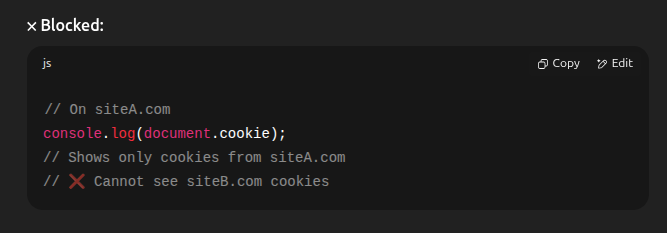
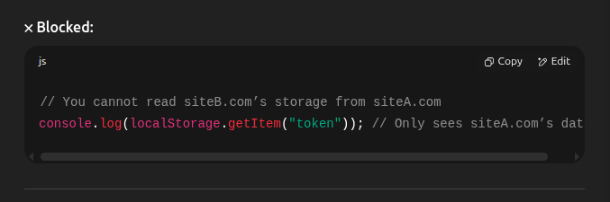
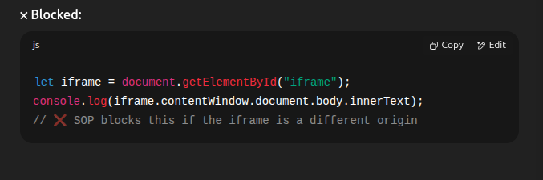

# Same-Origin-Policy(SOP) - The Default Security Rule

1. This is the browser's main security rule. It says that a website (Website A) can only read data from another website (Website B) if they both come from the exact same "origin."

2. `What is an "Origin"? Think of it like a website's full address, including:`

   1. Protocol: http:// or https:// (e.g., https is different from http)

   2. Domain (Host): google.com or facebook.com (e.g., app.example.com is different from api.example.com)

   3. Port: The number after the domain if specified (e.g., :8080 is different from :3000)

   Example:

   - https://mybank.com/account and https://mybank.com/transactions are Same-Origin.
   - https://mybank.com and http://mybank.com are DIFFERENT Origins (protocol).
   - https://mybank.com and https://secure.mybank.com are DIFFERENT Origins (domain/host).
   - https://mybank.com and https://mybank.com:8080 are DIFFERENT Origins (port).

3. Why it exists: To prevent malicious websites from stealing your sensitive data.

   1. **_Without SOP_**: If you're logged into your bank on one tab and then visit a bad website on another tab, that bad website's code could secretly ask your bank for your account details and read them. SOP stops this!

4. **_What it blocks_**: Mostly, it blocks JavaScript from reading responses from cross-origin requests. It usually allows actions like clicking links or submitting forms to other origins, but it prevents reading the response data.

# What is Same Origin Policy (SOP)
1. The Same-Origin Policy (SOP) is a web browser security feature that allows scripts running on a web page to access resources and data only from the ***same origin*** (same domain, protocol, and port). It blocks access to content from different origins by default.

2. To allow cross-origin access, the server must be configured to send the appropriate CORS (Cross-Origin Resource Sharing) headers.

***The Same-Origin Policy (SOP) does not block the response from reaching the browser — it blocks JavaScript from accessing the response unless CORS explicitly allows it.***

1. The backend does send a response
2. The browser receives the response.
3. But Javascript on the page cannot read the response unless the server includes the proper CORS header.

# Same Origin
Two origins are considered the same origin if their protocol, host (domain), and port are exactly the same.

# Working of Same Origin Policy

# What SOP Blocks
Same Origin Policy does not block the request itself - it blocks access to sensitive data or behavior across origins.

1. Reading API Response Data from Another Origin
You can send fetch() or XMLHttpRequest to another site,
but you can't read the response unless CORS is enabled.

2. Reading Cookies from Another Origin
JavaScript cannot access cookies set by a different domain.

3. Accessing localStorage / sessionStorage of Another Origin
Each origin has its own ***localstorage*** and ***sessionStorage***

4. Accessing DOM of Cross-Origin Frames
If you embed another site in an ***iframe***, you cannot access it DOM from Javascript

5. Listening to Events in Cross-Origin Windows or Frames
You cannot capture mouse/keyboard events inside a cross-origin iframe.

6. Accessing Cross-Origin Redirect Responses
When a request to another origin is redirected, the final redirected response is blocked from being read.

***References***
- https://developer.mozilla.org/en-US/docs/Web/Security/Same-origin_policy
- https://emrebener.medium.com/a-comprehensive-guide-to-the-same-origin-policy-and-the-cors-policy-4ca7535b0145
- https://www.cobalt.io/blog/browser-security-same-origin-policy-vs-cors-misconfigurations
